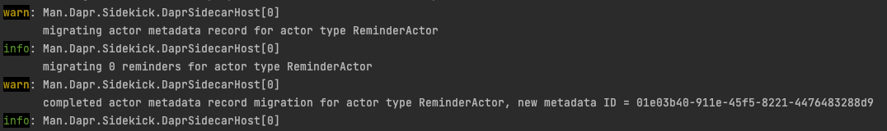

# dapr-actor-reminder-partitioning
Test application to determine of the Dapr API changes behavior if reminder partitioning is enabled.

## Test 1 --> Actor reminder partitioning disabled
### Application

1. Create Reminder --> 200
2. Get Reminder --> 200
3. Delete Reminder --> 200
4. Delete Reminder --> 200
5. Create Reminder --> 200
6. Create Reminder --> 200
7. Get Reminder --> 200
8. Delete Reminder --> 200

### Dapr API
1. Create Reminder --> 204
2. Get Reminder --> 200
3. Delete Reminder --> 204
4. Delete Reminder --> 204
5. Create Reminder --> 204
6. Create Reminder --> 204
7. Get Reminder --> 200
8. Delete Reminder --> 204

## Test 2 --> Actor reminder partitioning enabled

### Application
1. Create Reminder --> 200
2. Get Reminder --> 200
3. Delete Reminder --> 200
4. Delete Reminder --> 500 (Exception)
5. Create Reminder --> 200
6. Create Reminder --> 200
7. Get Reminder --> 200
8. Delete Reminder --> 200

#### Dapr API
1. Create Reminder --> 204
2. Get Reminder --> 200
3. Delete Reminder --> 204
4. Delete Reminder --> 500
5. Create Reminder --> 204
6. Create Reminder --> 204
7. Get Reminder --> 200
8. Delete Reminder --> 204

## Note
Based on this GitHub issue the sdk currently doesn't support the Get Reminder api.
https://github.com/dapr/dotnet-sdk/issues/772

However it probably makes sense to adjust this this functionality is it isn't possible to use an optimistic approach to delete reminders if reminder partitioning is enabled.